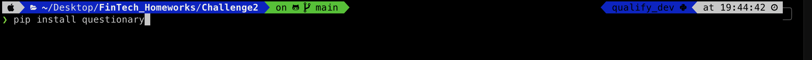
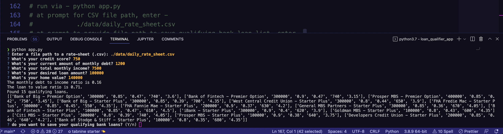
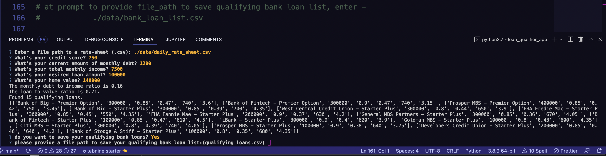
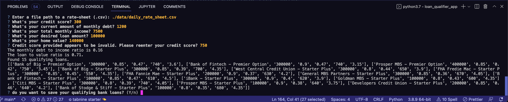
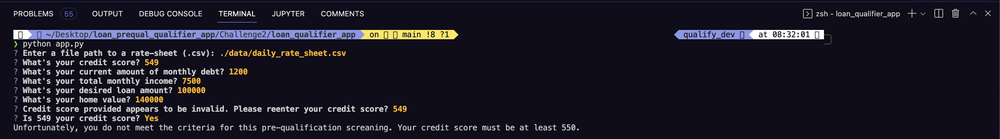

# **Columbia University Engineering, New York FinTech BootCamp** 
# **August 2022 Cohort**
## *Module 2, Challenge*

This is a command line interface (CLI) data processing application for bank loan pre-qualification screening.  This application matches loan applicants with banks and associated bank loans for which they may qualify.

The screening application is processed via applicant query for applicant specific data.  The user will input applicant's credit score, current debt level, income, the size of the loan desired, and the value of the applicant's collateral (i.e. current home value).  These data points are compared against the loan criteria of various lenders contained within a comma separated values (CSV) file, `daily_rate_sheet`.  

Through processing the loan applicant provided data and comparing it to the loan criteria of various lenders, the loan applicant's eligibility for the loan they are seeking is determined.  The program will output for the applicant their calculated monthly debt to income (DTI) ratio, loan to value (LTV) ratio, and, if they qualify, the number of banks with a list of those banks to which they are pre-qualified will be outputted.  The program will then offer to save the list of banks and loan data.  Upon selcting to save the data, the list of banks and loan data within a comma separated values (CSV) file, `bank_loan_list`.

---
## *Methods*

The command line interface operator/user will input

    file path for the `daily_rate_sheet`
    applicant's

        credit score
        monthly debt
        monthly income
        desired loan size
        current home value

    * the user / operator will be prompted for loan applicant's desire to save or not save,
    * the app will output as to available matches found or none found to be saved,
    * if no matches are identified, file path to save list of banks and associated loan data,
    * the user / operator will be be prompted for a fil path to where the list should be saved,
    * the user / operator will be finally be notified that the file has been saved to the specified path 

---
## Dependencies

This project leverages python 3.7 with the following packages:

* [sys](https://docs.python.org/3/library/sys.html?highlight=sys#module-sys) - System-specific parameters and functions

* [pathlib](https://docs.python.org/3/library/pathlib.html) - Object-oriented filesystem paths
  
* [csv](https://docs.python.org/3/library/csv.html?highlight=csv#module-csv) - File Reading and Writing

* [fire](https://github.com/google/python-fire) - For the command line interface, help page, and entrypoint.

* [questionary](https://github.com/tmbo/questionary) - For interactive user prompts and dialogs


## *Hardware used for development*

MacBook Pro (16-inch, 2021)

    Chip Appple M1 Max
    macOS Monterey version 12.5.1

## *Development Software*

Homebrew 3.5.10

    Homebrew/homebrew-core (git revision 0b6b6d9004e; last commit 2022-08-30)
    Homebrew/homebrew-cask (git revision 63ae652861; last commit 2022-08-30)

anaconda Command line client 1.10.0

    conda 4.13.0
    Python 3.7.13

pip 22.1.2 from /opt/anaconda3/envs/dev/lib/python3.7/site-packages/pip (python 3.7)

    fire 0.4.0
    questionary 1.10.0

git version 2.37.2

Visual Studio Code version: 1.71.0 (Universal)

---
## *Pre-Installation Guide*

Before running the application first install the following dependencies.

```python
  pip install fire
  pip install questionary
```



* if difficulties with installation, please refer to additional instructions as below:*
  
  [fire](https://github.com/google/python-fire#installation) - for expanded information and installation instructions

---
## *Installation of application (i.e. github clone)*

 In the terminal, navigate to directory where you want to install this application from the repository and enter the following command

```python
git clone git@github.com:Billie-LS/FinTech_Homeworks.git
```

---
## *Usage*

From terminal, the installed application is run from the installed directory by typing at prompt:

```python
  > python app.py
```
the following images will display sequential steps and prompts under three example protypical applicant scenarios.

###    scenario 1 - typical good candidate
        credit score 750, 
        monthly debt $1200, 
        monthly income $7500, 
        desired loan size $100000,
        current home value $140000





###    scenario 2 - good candidate, mistakenly enterred wrong / inadequate credit score



###    scenario 3 - candidate with inadequate credit score 




###    scenario 4 - good candidate seeking too large a loan


---
## *Requirement stories and acceptance criteria*

    Provided in separate file within the loan_qualifier_app directory

---
## Contributors

*Author*

    Loki 'billie' Skylizard
    > [LinkedIn](https://www.linkedin.com/in/l-s-6a0316244)

*BootCamp lead instructor*

    Vinicio De Sola

*BootCamp teaching assistants*

    Corey Recai
    Santiago Pedemonte

*BootCamp classmates*

    Dinesh Mandal
    Will Conyea

*Slack application, student support services via 'askBCS'*

    Laanu Adeyeye
    Tristen Ortiz

---
## License

MIT

